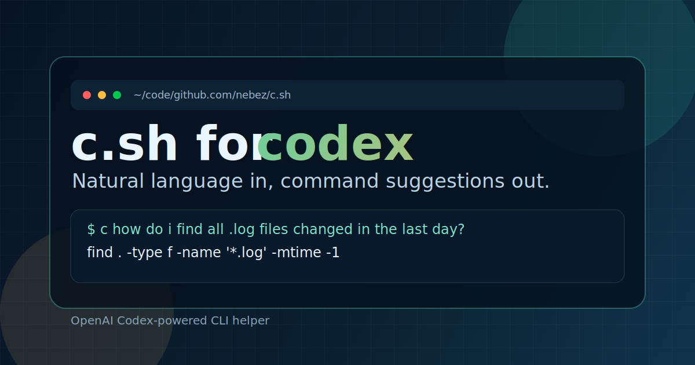

# c.sh



Use Codex to help you with CLI command translation. OpenAI-only, because Codex is the whole point.

## Demo

<video width="320" height="240" controls>
  <source src="assets/recording.mp4" type="video/mp4">
  Your browser does not support the video tag.
</video>

## Why

I've been using codex so much it's hard to imagine using any other tooling that provides comparable DX... so I disabled the AI features in my IDE and terminal. I still use Codex in Zed through ACP. But very infrequently.

The one feature I missed most was asking my terminal for help remembering a command. So I brought that functionality back to my terminal using `codex`, a shell script, and an alias. `c.sh` is a thin wrapper around `codex exec` for command suggestions. It asks Codex for help non-interactively and, if re-invoked in the same directory (within a time window), will offer alternative suggestions.

I've tested this exclusively on `zsh`. It should work on `bash` too (including macOS versions).

## Options

```text
Usage: c [--new] [-v|-vv] <question...>

Options:
  --new                     force a new conversation
  -v, --verbose             show wrapper diagnostics
  -vv                       show full debug output
  -m, --model               model name (default: gpt-5.1-codex-mini)
  -w, --window              auto-resume window in seconds (default: 300)
  -r, --reasoning-effort    model reasoning effort (default: low)
```

Examples:

```bash
c "how do i list files over 100MB?"
c --new "find node processes and show full command lines"
echo "search recursively for TODO comments" | c
```

## Install

Ensure you have the below available:

- `codex`
- `bash` *(but it can be invoke from `.zsh` or comparable)*
- `jq`

Then open [`c.sh`](https://github.com/nebez/c.sh/blob/main/c.sh), inspect it, and if you decide you like it, copy+paste it somewhere to your liking and invoke it. If that's not enough for you, however, continue reading.

There are no one-line installation instructions and I don't intend on adding one. After you've put `c.sh` somewhere on your computer, here are a few ways to install it assuming it exists at `/absolute/path/to/c.sh`.

### 1) Simple PATH install

```bash
install -m 0755 /absolute/path/to/c.sh ~/.local/bin/c
```

### 2) Home Manager / Nix

```nix
home.packages = [
  (pkgs.writeShellScriptBin "c" (builtins.readFile /absolute/path/to/c.sh))
  pkgs.jq
  # all your other packages
];
```

### 3) `.bashrc` or `.zshrc`

Put this somewhere in your `~/.zshrc` or `~/.bashrc` file:

```bash
c() {
  bash /absolute/path/to/c.sh "$@"
}
```
